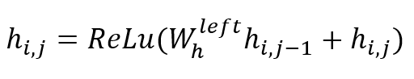
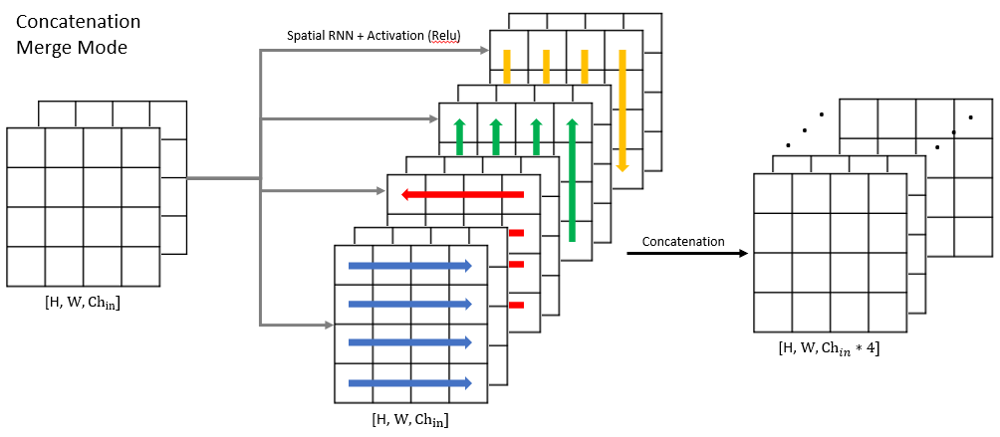
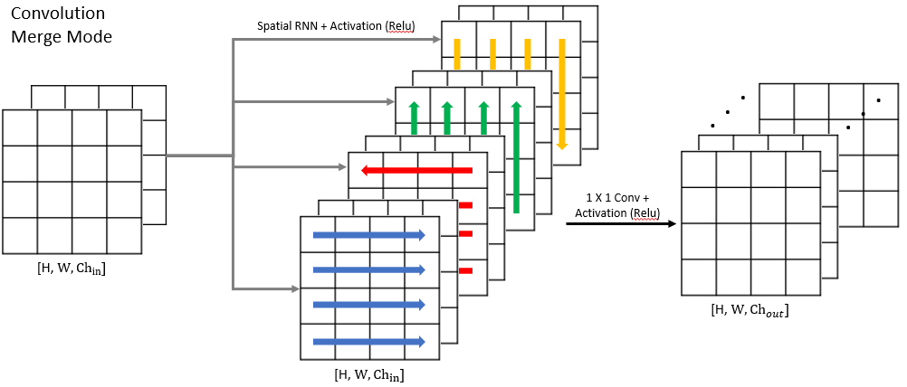

# 2D Spatial RNN

#### Note: This code is offered without any warranty.

## Abstract (TLDR)
  * A 2D Spatial RNN layer that can learn spatial connections between pixels of an 2D image in an RNN fashion 
  along all four directions of up, downs,left and right.
  * The length of sequence of inputs is a dynamic parameter which is the number of cell chain fed to RNN Module. 
  * The RNN unit is plain RNN with ReLu activation function (default) as suggested by Li et. al. (2019).  
  * The spatial connections will be learned and analysed along all four principal directions sweeping to right, left, 
  down, up, in that order. 

# Table of contents

<!--ts-->
   * [Table of contents](#table-of-contents)
   * [Introduction](#introduction)
   * [How it works](#how-it-works)
   * [Requirements](#requirements)
   * [Installation](#installation)
   * [Code Sample](#code-sample)
   * [Tests](#tests)
   * [Literature and References](#literature-and-References)
<!--te-->


# Introduction

This repository aims to offer a spatial RNN network, implemented in Tensorflow 2.0 with Keras API. The RNN element of 
the network is a plain RNN unit developed for integrating local spatial context between pixels of a 2D image with 
various channels. The network is developed to analyse the spatial sequence in all four principal directions of up, 
down, right or left, separately, or all four directions together. The length of pixel sequence fed to RNN 
unit is a dynamic parameter and the spatial connections will be learned and analysed along all four principal 
directions sweeping to right, left, down, up. The This technique of image analysis is claimed to be able to 
"effectively learn multi-scale and 
long-range spatial contexts to combat the challenges, such as the poor image quality, low contrast, boundary ambiguity, 
and complex anatomy shapes." (Li et. al., 2019)
 
There has is another repo with goal of implementing spatial RNN for 2D images in tensorflow 2 
[Multidimensional Recurrent Neural Networks](https://github.com/T-Almeida/tensorflow-keras-multidimensional-rnn). 
However, in my experience, this repo does not work with the input 2D images with edge sizes more than 100 due to highly 
complex back-propagation graph. Almost all the pixels are related to each other. 

The idea of this repo was first came to me as I was developing the CR-UNET network proposed by Li et. al. (2019). 
I could not find 
any implementation for their proposed network. Although, the implementations are different, the main concept is similar.


# How it works

The pixel sequencing for RNN unit is developed according to Li et. al. (2019); "there are data translations in four 
directions (i.e., up, down, left and right). We take data translation to the left to right as an example (similarly for 
other directions). Denoting ℎ𝑖,𝑗 as the feature at pixel (i, j), we repeat the following operation n times. 



where n is the pixel sequence length parameter and 𝑊ℎ left is the weight parameter in recurrent translation layer 
for the left-to-right direction." Figure below further illustrates the data transition where each entry has access to 
n previous states in left direction. The RNN unit is plain RNN with ReLu activation function (default) as suggested by 
Li et. al. (2019), however, the activation function can be chosen according to tensorflow.python.keras library.

The length of sequence should be defined when layer is initiated using the parameters of "rnn_seq_length".
The sequence length should be an integer between 1 and (image edge size - 1). The sequence length of equal to or bigger 
than image edge size will not break the code and the results would be similar to the sequence length of equal to
(image edge size - 1). However, the higher the length of sequence, the more computation will be needed. Therefore, it 
is recommended to that the sequence length should be less than image edge size.

The input to the layer is assumed to have a shape of (batch, height, width, channels).
The spatial connections will be analysed in all principal directions sweeping to right, left, down, up and the results 
for each direction will have same shape as input, (batch, height, width, channels).
The results from spatial RNN analysis in each of principal directions would have exact same shape of input and can be 
concatenated or merged together depending on "merge_mode" input parameter. 
The "merge_mode" input parameter can be set to either 'concat' (default) or 'convolution'. By default, the results for 
all principal directions will be concatenated together resulting in a final output shape with 4 times number of 
channels as the input channels. In case of 'convolution' merge mode, the results for all principal directions will be 
concatenated. Then the number of channels will be converted using a 1*1 2D convolution layer.
The output number of channels will be determined based on the 'output_conv_filter' input parameter. 
'output_conv_filter' input parameter should also be defined at time of initialized the layer and by default it is 
set to input shape number of channels .

Images below show the analysis process and expected output in case of 'concat' (default) or 'convolution' merge modes.
 


 
        
The input 2D image is recommended to be square as sufficient testing with non-square input images has not been done. 
When using this layer as the first layer,
preceded it with an Keras "Input" layer. Should be used with `data_format="channels_last"`. The kernel initializer and 
activation functions can be set using the ones
available in tensorflow.python.keras.initializers & tensorflow.python.keras.activations.


# Requirements
  * Python 3.7
  * Python packages: numpy==1.19.0, Keras==2.4.3 & Tensorflow==2.2.0
  * For installing Tensorflow-gpu (highly recommended) please see [Tensorflow](https://www.tensorflow.org/).
  
  If planning to run on virtual env, Anaconda3 "environment.yml" is included.   
  * Create the environment: conda env create -f environment.yml
  * Activate the environment: conda activate tfmd_py3.7_tf2 


# Installation
1. Clone the repository.
2. Install the requirements:   
`pip install -r requirements.txt`
3. To test the code, run the test script:  
`python -m unittest test.Testings`
4. Import the SpatialRNN2D layer and incorporate it in your main network. 

# Code Sample
```python
# importing required packages as well as spatial rnn layer 
import numpy as np
import tensorflow as tf
from Spatial_RNN_2D import SpatialRNN2D

image = np.array(range(0, 18, 2)).reshape([1, 3, 3, 1], order='F') #  input image shape (batch=1, H=3, W=3, Ch=1)
print (image[0,:,:,0])
#  [[ 0,  6, 12],
#   [ 2,  8, 14],
#   [ 4, 10, 16]]

tf.keras.backend.clear_session()
x_in = tf.keras.layers.Input(image.shape[1:])

y_out_concat = SpatialRNN2D(rnn_seq_length=2, kernel_initializer='ones', merge_mode='concat')(x_in) 
model_concat = tf.keras.Model(inputs=x_in, outputs=y_out_concat)
output_concat = model_concat.predict(image)
print("Output tensor shape is %s" %str(output_concat.shape))  # Output tensor shape is (1,3,3,4) 
print (output_concat[0,:,:,0])
#  left to right sweep
#  [[ 0,  6, 18],
#   [ 2, 10, 24],
#   [ 4, 14, 30]]

print (output_concat[0,:,:,1])
#  right to left sweep
#  [[ 18, 18, 12],
#   [ 24, 22, 14],
#   [ 30, 26, 16]]


y_out_conv = SpatialRNN2D(rnn_seq_length=3, kernel_initializer='ones', merge_mode='convolution',
                                output_conv_filter=1)(x_in)
model_conv = tf.keras.Model(inputs=x_in, outputs=y_out_conv)
output_conv = model_conv.predict(image)
print("Output tensor shape is %s" %str(output_conv.shape))  # Output tensor shape is (1,3,3,1) 
print (output_conv[0,:,:,0])
#  Merge all 4 channels into 1 channels using 1X1 convolution with kernel ones. Sum of all channels. 
#  [[ 24, 54,  84],
#   [ 34, 64,  94],
#   [ 44, 74, 104]]
```

# Tests
Run the tests as mentioned in [Installation section](#installation).

# Future improvements
* Adding support for various RNN units such as GRU and LSTM. 
* Further testing for edge cases and improving training accuracy and performance.

# Literature and References
Literature with similar works proposed or implemented in case of NLP or computer vision are as follows:
  * [CR-Unet: A Composite Network for Ovary and Follicle Segmentation in Ultrasound Images](https://pubmed.ncbi.nlm.nih.gov/31603808/)
  * [Scene labeling with LSTM recurrent neural networks](https://ieeexplore.ieee.org/abstract/document/7298977)
  * [Inside-Outside Net: Detecting Objects in Context with Skip Pooling and Recurrent Neural Networks](https://arxiv.org/abs/1512.04143)
  * [ReNet: A Recurrent Neural Network Based Alternative to Convolutional Networks](https://arxiv.org/abs/1505.00393)