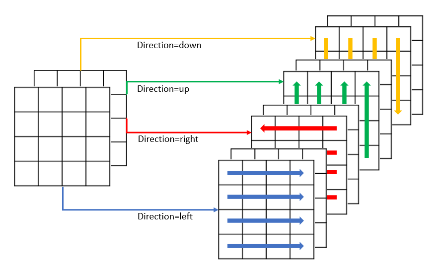

# 2D Spatial RNN

#### Note: This code is offered without any warranty.

## Abstract (TLDR)
  * A 2D Spatial RNN layer that can learn spatial connections between pixels of an 2D image in an RNN fashion 
  along all four directions of up, downs,left and right.
  * The length of sequence of inputs is a dynamic parameter which is the number of cell chain fed to RNN Module. 
  * The RNN unit is plain RNN with ReLu activation function instead of tanh as suggested by Li et. al. (2019).  
  * The principal direction along which the local spatial information will be integrated is also a dynamic parameter. 

# Table of contents

<!--ts-->
   * [Table of contents](#table-of-contents)
   * [Introduction](#introduction)
   * [How it works](#how-it-works)
   * [Installation](#installation)
   * [Code Sample](#code-sample)
   * [Tests](#tests)
   * [Literature and References](#literature-and-References)
<!--te-->


# Introduction

This repository aims to offer a spatial RNN network, implemented in tensorflow 2.0 with Keras API. The RNN element of 
the network is a plain RNN unit developed for integrating local spatial context between pixels of a 2D image with 
various channels. The network is developed to analyse the spatial sequence in all four principal  directions of uo, 
down, right or left, separately, aor all four together. The The length and direction of pixel sequence fed to RNN unit are 
dynamic parameters. This technique of image analysis is claimed to be able to "effectively learn multi-scale and 
long-range spatial contexts to combat the challenges, such as the poor image quality, low contrast, boundary ambiguity, 
and complex anatomy shapes." (Li et. al., 2019)
 
There has is another repo with goal of implementing spatial RNN fo r 2d images in tensorflow 2 
[Multidimensional Recurrent Neural Networks](https://github.com/T-Almeida/tensorflow-keras-multidimensional-rnn). 
However, in my experience, this repo does not work with the input 2D images with edge sizes more than 100 due to highly 
complex back-propagation graph. Almost all the pixels are related to each other. 

The idea of this repo was first came to me as I was developing the CR-UNET network proposed by Li et. al. (2019). I could not find 
any implementation for their proposed network. Although, the implementations are different, the main concept is similar.


# How it works

The pixel sequencing for RNN unit is developed according to Li et. al. (2019); "there are data translations in four 
directions (i.e., up, down, left and right). We take data translation to the left as an example (similarly for 
other directions). Denoting ℎ𝑖,𝑗 as the feature at pixel (i, j), we repeat the following operation n times. 


where n is the pixel sequence length parameter and 𝑊ℎ left is the weight parameter in recurrent translation layer 
for the left direction." Figure below further illustrates the data transition where each entry has access to n previous 
states in left direction. 



The direction and length of sequence should be defined when layer is initiated using the parameters of "direction" and 
"rnn_radius", respectively. The sequence direction should be to "left", "right", "up", "down" or "all" (default). The 
sequence length should be an integer between 1 and image edge size. 
The output image will have same height and width as the input image. 
For each principal direction , the 
RNN unit will have as many set of kernels as number of channels resulting to channels for each transition direction 
being equal to input 
channels of the 2D-image. Therefore, with an input image of (Batch=1, Height, Width, Channels),the output of the layer 
will be (Batch=1, Height, Width, Channels) or (Batch=1, Height, Width, Channels * 4) should the direction parameter 
is set to either {"left", "right", "up", "down"}; or "all".    

It's worth mentioning that The current implementation only works for 2D images and training batch size of 1. The input 2D image is recommended to 
be square as sufficient testing with non-square input images has not been done.


# Installation
1. Clone the repository.
2. Install the requirements by running pip install -r requirements.txt
3. To test the code, run the test script.
4. Import the 2D Spatial RNN layer and incorporate it in your main network. 

# Code Sample
```python
# importing required packages as well as spatial rnn layer 
import numpy as np
import tensorflow as tf
from Conv_advance import Conv2DSpatial
image = np.array(range(0, 25)).reshape([1, 5, 5, 1])
image = np.concatenate((image, image + 25), axis=-1) # input image shape (1,5,5,2)

tf.keras.backend.clear_session()
x_in = tf.keras.layers.Input((5, 5, image.shape[-1]))
spatial_rnn = Conv2DSpatial(rnn_radius=4, direction='all') 
y_out = spatial_rnn(x_in)
model = tf.keras.Model(inputs=x_in, outputs=y_out)
model.summary()

a = model.predict(image)
print("Output tensor shape is %s" %str(a.shape))
```

# Tests
To be added in near future.

# Future improvements
* Adding support for 3D input (stack of 2D images) and confirming the performance for non-square input images. 
* Adding support for various RNN units such as GRU and LSTM. 
* Further testing for edge cases and improving training accuracy and performance.

# Literature and References
Literature with similar works proposed or implemented in case of NLP or computer vision are as follows:
  * [CR-Unet: A Composite Network for Ovary and Follicle Segmentation in Ultrasound Images](https://pubmed.ncbi.nlm.nih.gov/31603808/)
  * [Scene labeling with LSTM recurrent neural networks](https://ieeexplore.ieee.org/abstract/document/7298977)
  * [Inside-Outside Net: Detecting Objects in Context with Skip Pooling and Recurrent Neural Networks](https://arxiv.org/abs/1512.04143)
  * [ReNet: A Recurrent Neural Network Based Alternative to Convolutional Networks](https://arxiv.org/abs/1505.00393)